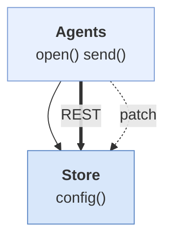
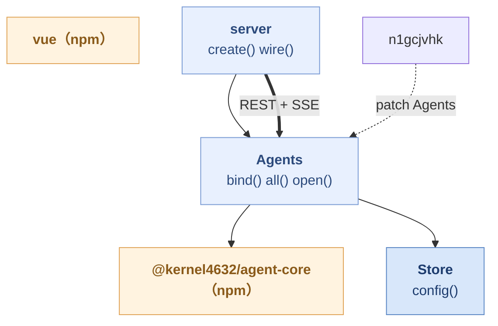

# 架构图渲染试验（临时）

## A：最小图

```mermaid
graph TD
    A["<b>Agents</b><br/>open()  send()"]:::backend
    B["<b>Store</b><br/>config()"]:::store
    A --> B
    A == REST ==> B
    A -. patch .-> B
    classDef backend fill:#e8f0fe,stroke:#7a9bd4
    classDef store fill:#d8e7fa,stroke:#5a86c4
```

## B：真实宏观图第一段（前 40 行）

```mermaid
graph TD
    n1n01kdc["<b>@kernel4632/agent-core（npm）</b>"]:::route
    ne4psym["<b>vue（npm）</b>"]:::route
    nhqebqq["<b>server</b><br/>create()  wire()"]:::backend
    nbxek49["<b>Agents</b><br/>bind()  all()  open()"]:::backend
    n4hgrwm["<b>Store</b><br/>config()"]:::store
    nbxek49 --> n1n01kdc
    nbxek49 --> n4hgrwm
    nhqebqq --> nbxek49
    nhqebqq == REST + SSE ==> nbxek49
    n1gcjvhk -. patch Agents .-> nbxek49
    classDef backend fill:#e8f0fe,stroke:#7a9bd4,color:#2c4a7c
    classDef store fill:#d8e7fa,stroke:#5a86c4,color:#1d3c6e
    classDef route fill:#fff3e0,stroke:#e0a458,color:#8a5a1a
```
